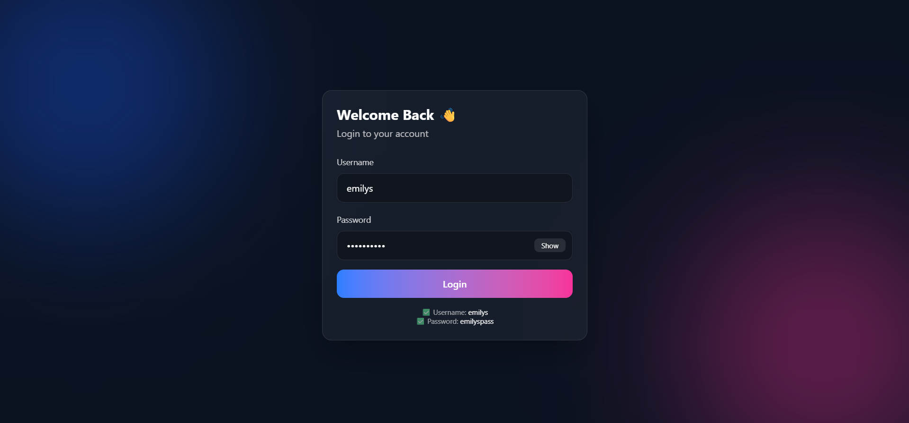
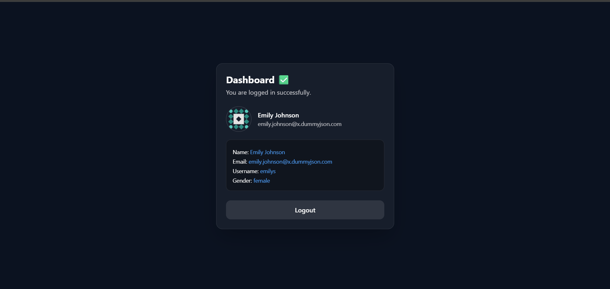

# LoginAuth

A simple authentication flow built with **Vue 3 + TypeScript + Vite + TailwindCSS**, featuring **API login integration**, **token-based route guard**, and a **protected dashboard**.

---

## ✨ Features

✅ Login using API integration  
✅ Fetch token + authenticated user details  
✅ Redirect to Dashboard after login  
✅ Dashboard displays:

- Username
- Email
- Profile image

✅ Logout functionality  
✅ Route guard blocks dashboard access if token is missing/invalid

---

## 🛠️ Tech Stack

- **Vue 3**
- **Vite**
- **TypeScript**
- **Vue Router**
- **TailwindCSS**
- Token-based Authentication

---

## 📂 Project Structure (Typical)

````bash
src/
├─ assets/
├─ components/
├─ pages/
│  ├─ Login.vue
│  └─ Dashboard.vue
├─ router/
│  └─ index.ts
├─ services/
│  └─ api.ts
├─ utils/
│  └─ auth.ts
├─ App.vue
└─ main.ts


> Structure may vary depending on your implementation.

---

## 🚀 Getting Started

### 1️⃣ Clone the repository

```bash
git clone https://github.com/payalgondane33/vue-login-auth.git
cd vue-login-auth
````

npm install
touch .env
VITE_API_BASE_URL=https://your-api-url.com
npm run dev
npm run build
npm run preview

🔐 Authentication Flow
✅ Login

User enters credentials on the Login page

App calls the Login API

API returns a token

Token is saved in browser storage

App fetches authenticated user profile using the token

Redirects to Dashboard

✅ Dashboard (Protected Route)

Dashboard is protected using Vue Router navigation guards:

If token exists → allow access

If token missing/expired → redirect to Login

✅ Logout

Clears token + stored user data

Redirects to Login page

🧠 Route Guard Logic (Summary)

Dashboard route checks for auth token

Without token, user cannot access Dashboard

Works even after refresh (token persists in storage)

### Login




### Dashboard




📌 Notes

Token is stored in: localStorage / sessionStorage (depending on implementation)

User details are fetched from API after login

Profile image is displayed in dashboard if API returns image URL

📄 License

This project is open-source and free to use.

👤 Author

Payal Gondane
GitHub: payalgondane33

"""
